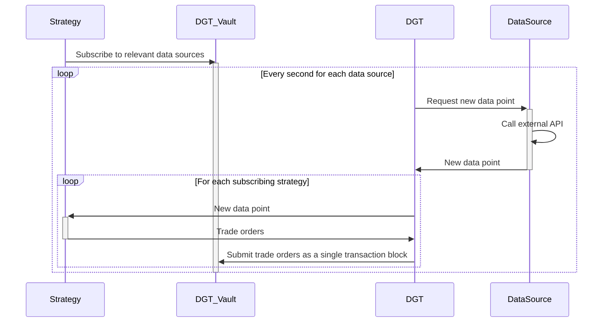

# DigiTrust

DigiTrust is the decentralized asset management protocol

## Overview

## Installation

1. Clone this repository.
2. Install dependencies with `npm install`.

## Build and Run the Bot

Build the project with `npm run build`

Run the script with `npm run start`